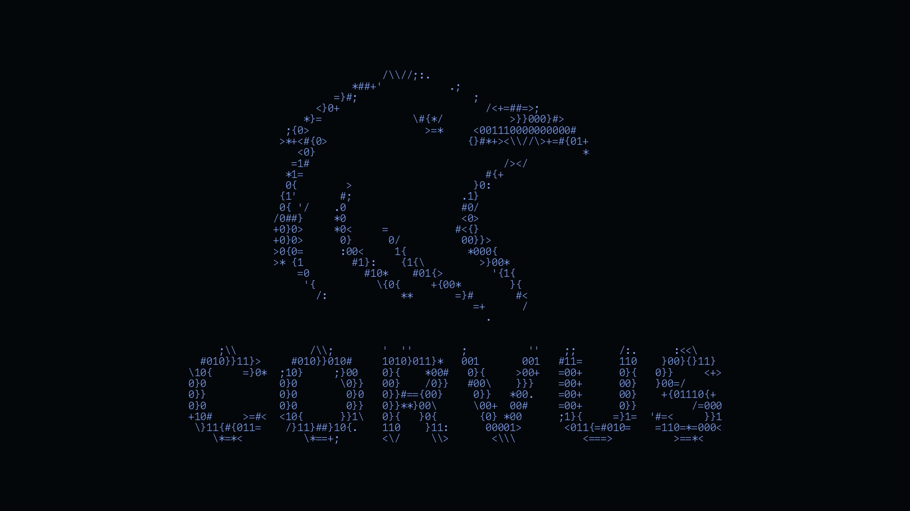

<div align="center">



# corvus-tech.co

**The bilingual 3D portfolio of Corvus Tech — a product studio in Istanbul.**

[](https://corvus-tech.co)
[](https://nextjs.org)
[](https://threejs.org)
[](https://www.typescriptlang.org)

</div>

## What it is

A portfolio that behaves like a product: a real-time 3D scene as the stage,
34 shipped products as the cast, and every word available in both English
and Turkish.

- **3D scene** — an interactive Three.js stage rendered inside React, tuned to stay smooth on mobile.
- **Bilingual by design** — full EN/TR localization (`/` and `/tr`), not a bolted-on translate button.
- **Product showcase** — iOS apps, web platforms, trading systems and AI agents, each with its own story.
- **Motion with restraint** — scroll-driven scenes that respect `prefers-reduced-motion`.

## Stack

Next.js (App Router) · TypeScript · Three.js · Tailwind CSS · deployed on Vercel

## Run locally

```bash
npm install
npm run dev
# open http://localhost:3000
```

---

<div align="center">

Built by [Ekrem Mert](https://github.com/ekremmertu) · [corvus-tech.co](https://corvus-tech.co)

</div>
